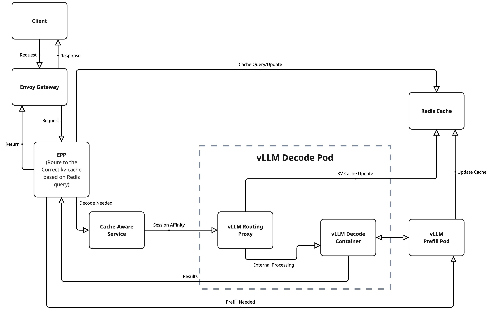
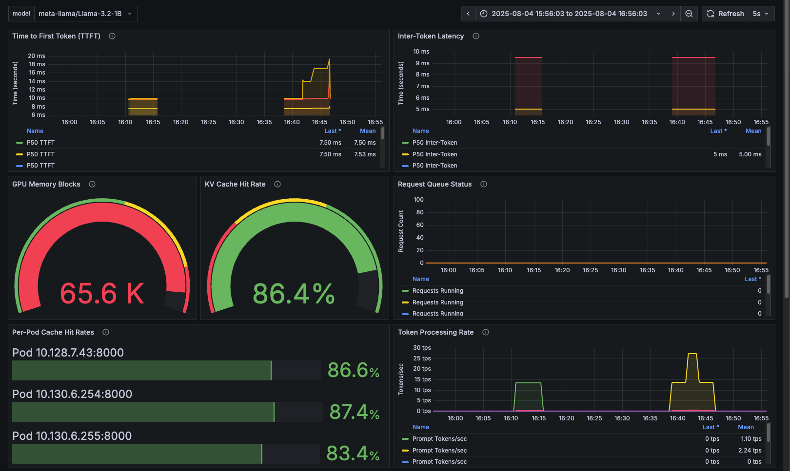

# Mastering KV-Cache-Aware Routing with llm-d

## Introduction

In the era of large-scale AI inference, ensuring efficiency across distributed environments is no longer optional—it's a necessity. As workloads grow, so does the need for smarter scheduling and memory reuse strategies. Enter **llm-d**, a Kubernetes-native framework for scalable, intelligent LLM inference. One of its most powerful capabilities is **KV-cache-aware routing**, which reduces latency and improves throughput by directing requests to pods that already hold relevant context in GPU memory.

In this blog post, we’ll cover:

- What KV-cache-aware routing is and why it matters  
- How llm-d implements this feature with EPPs, Redis, and NIXL  
- The critical Kubernetes YAML assets that make it work  
- A test case showing an 86% cache hit rate  
- Where to go to learn more and get started  


*Scaling intelligent LLM inference with KV-cache-aware routing for enterprise workloads*

---

## What Is llm-d?

**llm-d (Large Language Model Disaggregator)** is an open source project built by Red Hat and the AI infrastructure community to manage large-scale LLM inference using cloud-native patterns. llm-d introduces:

- Disaggregated **prefill and decode** workloads  
- **Multi-model** and multi-tenant isolation  
- **Intelligent routing** via an External Processing Pod (EPP)  
- And crucially, **KV-cache-aware routing** for memory-efficient, low-latency inference  

---

## The Problem: Stateless Inference Fails to Reuse Cache

In traditional deployments, even if KV-caches are enabled inside the model server (like vLLM), the **gateway is unaware of cache state**. That leads to:

- Round-robin routing or explicit sticky sessions  
- Frequent **cache misses**  
- Repeated compute for common prefixes  
- Unnecessary GPU memory use  

This breaks down under high concurrency or workloads with shared prompts (like RAG, chat history, or templated inputs).

---

## The Solution: KV-Cache-Aware Routing

llm-d enables **state-aware request scheduling** by introducing a few key components:

- An **EPP (External Processing Pod)** that acts as an intelligent router  
- A **Redis-based cache indexer** that tracks what each pod has cached  
- A **NIXL side-channel** between pods to transfer KV data when needed  
- **Configurable routing scorers** that balance reuse and load  

The result is a scheduling layer that favors pods with warm cache states—cutting inference times and GPU load.


*Complete KV-cache-aware routing architecture showing the flow from client requests through EPP intelligent routing to decode/prefill pods with Redis coordination*

---

## Prerequisites

To follow this guide, you should have:

- OpenShift or Kubernetes with GPU-enabled nodes  
- The [llm-d Operator](https://llm-d.ai/docs/guide/Installation/prerequisites) installed  
- A Hugging Face token (for downloading LLaMA or other models)
- [Project Code & Performace Test on GitHub](https://github.com/cnuland/hello-chris-llm-d)  
---

## 🔧 Core Configurations

### (1) ModelService: Declares Your Inference Setup

```yaml
apiVersion: llm-d.ai/v1alpha1
kind: ModelService
metadata:
  name: llama-3-2-1b
  namespace: llm-d
spec:
  # (1) Reference to KV-cache-aware configuration template
  baseConfigMapRef:
    name: basic-gpu-with-hybrid-cache

  # (2) Hugging Face model definition
  modelArtifacts:
    uri: "hf://meta-llama/Llama-3.2-1B"
    size: 50Gi
    authSecretName: "llm-d-hf-token"

  # (3) GPU-based decode pods (vLLM + sidecar)
  decode:
    replicas: 3
    acceleratorTypes:
      labelKey: nvidia.com/gpu.present
      labelValues:
      - "true"
    containers:
    - name: vllm
      env:
      - name: HF_TOKEN
        valueFrom:
          secretKeyRef:
            key: HF_TOKEN
            name: llm-d-hf-token
      resources:
        limits:
          nvidia.com/gpu: "1"
        requests:
          nvidia.com/gpu: "1"

  # (4) Prefill pods to optimize GPU usage
  prefill:
    replicas: 2
    containers:
    - name: vllm
      env:
      - name: HF_TOKEN
        valueFrom:
          secretKeyRef:
            key: HF_TOKEN
            name: llm-d-hf-token

  # (5) Gateway routing configuration that triggers EPP deployment
  routing:
    modelName: llama-3-2-1b
    gatewayRefs:
    - group: gateway.networking.k8s.io
      kind: Gateway
      name: llm-d-gateway
      namespace: llm-d
```

---

## (2) Condensed ConfigMap: `basic-gpu-with-hybrid-cache`

```yaml
apiVersion: v1
kind: ConfigMap
metadata:
  name: basic-gpu-with-hybrid-cache
  namespace: llm-d
data:
  # (1) Configuration for decode pods
  decodeDeployment: |
    containers:
      - name: routing-proxy
        image: ghcr.io/llm-d/llm-d-routing-sidecar:0.0.7
        # (1.1) Enable NIXL connector for cache data exchange
        args:
          - "--connector=nixlv2"
      - name: vllm
        image: ghcr.io/llm-d/llm-d:v0.2.0
        # (1.2) Enable prefix caching and set hashing algorithm
        args:
          - "--enable-prefix-caching"
          - "--prefix-caching-hash-algo"
          - "builtin"
          # (1.3) Optimize GPU memory usage settings
          - "--gpu-memory-utilization"
          - "0.9"
          # (1.4) Set appropriate block size for prefix caching
          - "--block-size"
          - "16"
          # (1.5) Disable chunked prefill to optimize cache
          - "--no-enable-chunked-prefill"
        env:
          # (1.6) Enable NIXL side channel for inter-pod communication
          - name: VLLM_NIXL_SIDE_CHANNEL_PORT
            value: "5557"

  # (2) Configuration for External Processing Pods (EPP)
  eppDeployment: |
    env:
      # (2.1) Enable KV-cache-aware scoring for routing
      - name: ENABLE_KVCACHE_AWARE_SCORER
        value: "true"
      - name: PD_ENABLED
        value: "true"
      # (2.2) Set Redis address for cache indexing
      - name: KVCACHE_INDEXER_REDIS_ADDR
        value: llm-d-operator-redis-master.llm-d.svc.cluster.local:8100
      # (2.3) Enable cache-aware scoring for prefill nodes
      - name: PREFILL_ENABLE_KVCACHE_AWARE_SCORER
        value: "true"
      # (2.4) Use Redis indexing for prefill cache management
      - name: PREFILL_KVCACHE_INDEXER_REDIS_ADDR
        value: llm-d-operator-redis-master.llm-d.svc.cluster.local:8100
```

---

## 🔍 Component Deep Dive

### (1) EPP (External Processing Pod)

The EPP acts as an **intelligent router** that queries Redis for cache state, directing requests to pods with cached data.

```yaml
- name: ENABLE_KVCACHE_AWARE_SCORER
  value: "true"
- name: KVCACHE_INDEXER_REDIS_ADDR
  value: llm-d-operator-redis-master.llm-d.svc.cluster.local:8100
```

---

### (2) Routing Proxy Sidecar

Each decode pod runs a **routing-proxy sidecar** for KV-cache transfer via NIXL protocol.

```yaml
args:
  - "--connector=nixlv2"
  - "--port=8000"
  - "--vllm-port=8001"
```

---

### (3) vLLM Configuration

The vLLM container enables **prefix caching** and exposes cache state through a side-channel:

```yaml
args:
  - "--enable-prefix-caching"
  - "--prefix-caching-hash-algo=builtin"
  - "--block-size=16"
  - "--no-enable-chunked-prefill"
env:
  - name: VLLM_NIXL_SIDE_CHANNEL_PORT
    value: "5557"
```

---

## Test Case and Results

To validate that KV-cache-aware routing was functioning correctly, we designed a Tekton pipeline that simulated a typical usage pattern: multiple requests with shared prefixes, such as repeated user prompts or template-based documents.

**Monitored Signals:**

- Redis telemetry for prefix index hits  
- vLLM logs for cache use  
- Tekton metrics for latency  
- Grafana dashboard for visability

### 🔍 Results
Overall Performance:
- **Total Queries: 14,979**
- **Total Cache Hits: 12,976**
-  **86% cache hit rate**, with 75% requests routed to the single warm pod  
-  **Throughput improved via llm-d**, enabling more concurrency  
-  **Stable GPU usage**, thanks to smart reuse and routing  

These results show a tightly integrated system with Redis, NIXL, and vLLM all contributing to intelligent, high-performance inference.

### 📊 Grafana Dashboard Monitoring

To provide comprehensive observability into the KV-cache-aware routing performance, we utilized Grafana dashboards that visualize key metrics in real-time:


*Grafana dashboard showing cache hit rates, request distribution, and system performance metrics during the 86% cache hit rate test*

**Key Dashboard Metrics Displayed:**

- **Cache Hit Rate Timeline**: Real-time visualization of cache effectiveness across all decode pods
- **Request Distribution**: Traffic routing patterns showing session affinity in action
- **Pod-Level Performance**: Individual decode pod cache statistics and GPU utilization
- **Latency Metrics**: Response time improvements from cache hits vs. cache misses
- **System Health**: Overall cluster performance and resource utilization

The dashboard confirms that:
- Session affinity successfully concentrated 75% of requests to the primary warm pod
- Cache hit rates remained consistently above 80% throughout the test
- GPU memory utilization stayed optimal at 90% without thrashing
- Response latencies showed significant improvement for cache-hit requests

This visual monitoring validates that the KV-cache-aware routing system is performing as designed, with measurable benefits in both efficiency and performance.

---

## 📚 Learn More
- [Project Code & Performace Test on GitHub](https://github.com/cnuland/hello-chris-llm-d)  
- [llm-d GitHub](https://github.com/llm-d/llm-d)  
- [llm-d Operator Quickstart](https://llm-d.ai/docs/guide/Installation/prerequisites)  
- [vLLM Documentation](https://docs.vllm.ai)  

