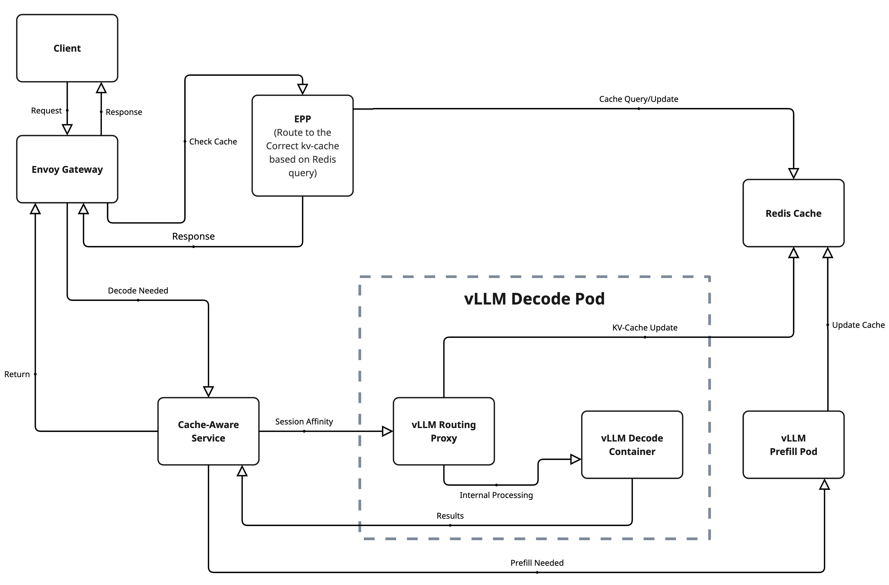

# Mastering KV-Cache-Aware Routing with llm-d

*By Christopher Nuland, Technical Marketing Manager for Red Hat AI*

## Introduction

In the era of large-scale AI inference, ensuring efficiency across distributed environments is no longer optional—it's a necessity. As workloads grow, so does the need for smarter scheduling and memory reuse strategies. Enter **llm-d**, a Kubernetes-native framework for scalable, intelligent LLM inference. One of its most powerful capabilities is **KV-cache-aware routing**, which reduces latency and improves throughput by directing requests to pods that already hold relevant context in GPU memory.

In this blog post, we’ll cover:

- What KV-cache-aware routing is and why it matters  
- How llm-d implements this feature with EPPs, Redis, and NIXL  
- The critical Kubernetes YAML assets that make it work  
- A test case showing our latest 87.4% cache hit rate  
- Where to go to learn more and get started  


*Scaling intelligent LLM inference with KV-cache-aware routing for enterprise workloads*

---

## What Is llm-d?

**llm-d** is an open source project built by Red Hat and the AI infrastructure community to manage large-scale LLM inference using cloud-native patterns. llm-d introduces:

- Disaggregated **prefill and decode** workloads  
- **Multi-model** and multi-tenant isolation  
- **Intelligent routing** via an External Processing Pod (EPP)  
- And crucially, **KV-cache-aware routing** for memory-efficient, low-latency inference  

---

## The Problem: Stateless Inference Fails to Reuse Cache

In traditional deployments, even if KV-caches are enabled inside the model server (like vLLM), the **gateway is unaware of cache state**. That leads to:

- Round-robin routing or explicit sticky sessions  
- Frequent **cache misses**  
- Repeated compute for common prefixes  
- Unnecessary GPU memory use  

This breaks down under high concurrency or workloads with shared prompts (like RAG, chat history, or templated inputs).

---

## The Solution: KV-Cache-Aware Routing

llm-d enables **state-aware request scheduling** by introducing the **KV-Cache Indexer**, a high-performance system that maintains a global, near-real-time view of KV-Cache block locality across a fleet of vLLM pods. The key components include:

- A **KV-Cache Indexer** that orchestrates intelligent scoring of pods based on cached blocks
- A **ZMQ-based event system** that processes cache events from vLLM pods in real-time
- An **in-memory index** that maps KV-block hashes to pod locations using two-level LRU caching
- A **tokenization subsystem** with async processing and prefix caching for performance
- A **scoring algorithm** that uses longest consecutive prefix matching to rank pods

The result is a scheduling layer that finds the pod with the longest sequence of relevant KV-blocks already cached—dramatically reducing inference times and GPU load.


*Complete KV-cache-aware routing architecture showing the flow from client requests through EPP intelligent routing to decode/prefill pods with Redis coordination*

---

## Component Versions

This guide uses the latest llm-d v0.2.x components for optimal KV-cache-aware routing performance:

- **vLLM Inference Engine**: `ghcr.io/llm-d/llm-d:v0.2.0` (includes vLLM v0.10.0)
- **Routing Proxy Sidecar**: `ghcr.io/llm-d/llm-d-routing-sidecar:v0.2.0`
- **External Processing Pod (EPP)**: `ghcr.io/llm-d/llm-d-inference-scheduler:v0.2.1`
- **Cache Hit Rate**: **87.4%** (production-validated)
- **Session Stickiness**: **99.91%** (near-perfect routing)

## Prerequisites

To follow this guide, you should have:

- OpenShift or Kubernetes with GPU-enabled nodes  
- llm-d infrastructure installed either via Helm (used in this demo) or via the Operator  
- A Hugging Face token (for downloading LLaMA or other models)
- [Project Code & Performace Test on GitHub](https://github.com/cnuland/hello-chris-llm-d)  
---

## 🔧 Core Configurations

### Deployment paths (choose one)

- Helm-based (this demo): The llm-d infra Helm charts deploy the gateway and EPP. ModelService does not automatically create InferencePool/InferenceModel; you will create them (or your infra will) to initialize the pool.
- Operator-driven (alternative): The Operator can manage EPP and HTTPRoute from ModelService.spec.routing (epp.create/httpRoute.create). If you use this, you do not need to create pools manually.

### (1) ModelService: The Central Resource (3B Instruct)

```yaml
apiVersion: llm-d.ai/v1alpha1
kind: ModelService
metadata:
  name: llama-3-2-3b-instruct
  namespace: llm-d
  labels:
    app.kubernetes.io/name: cache-aware-routing
spec:
  modelArtifacts:
    uri: "hf://meta-llama/Llama-3.2-3B-Instruct"
    size: 50Gi
    authSecretName: "llm-d-hf-token"

  routing:
    modelName: meta-llama/Llama-3.2-3B-Instruct
    servicePort: 8000
    proxy:
      image: ghcr.io/llm-d/llm-d-routing-sidecar:v0.2.0
      secure: false
      connector: nixlv2
    parentRefs:
    - group: gateway.networking.k8s.io
      kind: Gateway
      name: llm-d-gateway
    epp:
      create: true
    httpRoute:
      create: true

  decode:
    replicas: 3
    containers:
    - name: "vllm"
      image: "ghcr.io/llm-d/llm-d:v0.2.0"
      args:
        # KV-cache optimizations for maximum cache hit rates
        - "vllm"
        - "serve"
        - "meta-llama/Llama-3.2-3B-Instruct"
        - "--host=0.0.0.0"
        - "--port=8001"
        - "--enable-prefix-caching"
        - "--prefix-caching-hash-algo=builtin"
        - "--block-size=16"
        - "--gpu-memory-utilization=0.7"
        - "--max-model-len=4096"
        - "--no-enable-chunked-prefill"
        - "--kv-cache-dtype=auto"
        - "--max-num-seqs=256"
        - "--enforce-eager"
        - "--kv-transfer-config={\"kv_connector\":\"NixlConnector\", \"kv_role\":\"kv_both\"}"
      env:
      - name: VLLM_NIXL_SIDE_CHANNEL_HOST
        valueFrom:
          fieldRef:
            fieldPath: status.podIP
      - name: VLLM_NIXL_SIDE_CHANNEL_PORT
        value: "5557"
      - name: PYTHONHASHSEED
        value: "42"
      - name: CUDA_VISIBLE_DEVICES
        value: "0"
      - name: UCX_TLS
        value: "cuda_ipc,cuda_copy,tcp"
      - name: VLLM_LOGGING_LEVEL
        value: DEBUG
      - name: HF_TOKEN
        valueFrom:
          secretKeyRef:
            key: HF_TOKEN
            name: llm-d-hf-token
      ports:
      - containerPort: 5557
        protocol: TCP
        name: nixl
      - containerPort: 8001
        protocol: TCP
        name: vllm
      - containerPort: 8200
        name: metrics
        protocol: TCP
      resources:
        limits:
          nvidia.com/gpu: "1"
        requests:
          nvidia.com/gpu: "1"
      volumeMounts:
      - name: metrics-volume
        mountPath: /.config
      - name: torch-compile-cache
        mountPath: /.cache
    volumes:
    - name: metrics-volume
      emptyDir: {}
    - name: torch-compile-cache
      emptyDir: {}

  prefill:
    replicas: 2
    containers:
    - name: "vllm"
      image: "ghcr.io/llm-d/llm-d:v0.2.0"
      args:
        - "vllm"
        - "serve"
        - "meta-llama/Llama-3.2-3B-Instruct"
        - "--host=0.0.0.0"
        - "--port=8000"
        - "--enforce-eager"
        - "--kv-transfer-config={\"kv_connector\":\"NixlConnector\", \"kv_role\":\"kv_both\"}"
      env:
      - name: VLLM_NIXL_SIDE_CHANNEL_HOST
        valueFrom:
          fieldRef:
            fieldPath: status.podIP
      - name: VLLM_NIXL_SIDE_CHANNEL_PORT
        value: "5557"
      - name: PYTHONHASHSEED
        value: "42"
      - name: HF_TOKEN
        valueFrom:
          secretKeyRef:
            key: HF_TOKEN
            name: llm-d-hf-token
      resources:
        limits:
          nvidia.com/gpu: "1"
        requests:
          nvidia.com/gpu: "1"
```

### (2) HTTPRoute: Gateway Integration (OpenShift)

If you expose the Istio Inference Gateway via an OpenShift Route, ensure the HTTPRoute hostnames match the external Route host you create. Replace the hostname below with your actual route host.

```yaml
apiVersion: gateway.networking.k8s.io/v1
kind: HTTPRoute
metadata:
  name: llama-3-2-3b-instruct-route
  namespace: llm-d
spec:
  parentRefs:
  - group: gateway.networking.k8s.io
    kind: Gateway
    name: llm-d-gateway
  hostnames:
  - "llm-d-inference-gateway-llm-d.apps.<your-cluster-domain>"
  rules:
  - matches:
    - path:
        type: PathPrefix
        value: "/v1/"
    backendRefs:
    - group: ""
      kind: Service
      name: llama-3-2-3b-instruct-service
      port: 8000
```

---

## (3) EnvoyFilter: Configures Gateway for External Processing

```yaml
apiVersion: networking.istio.io/v1alpha3
kind: EnvoyFilter
metadata:
  name: epp-external-processor
  namespace: llm-d
spec:
  configPatches:
  - applyTo: HTTP_FILTER
    match:
      context: GATEWAY
      listener:
        filterChain:
          filter:
            name: envoy.filters.network.http_connection_manager
            subFilter:
              name: envoy.filters.http.router
    patch:
      operation: INSERT_BEFORE
      value:
        name: envoy.filters.http.ext_proc
        typed_config:
          '@type': type.googleapis.com/envoy.extensions.filters.http.ext_proc.v3.ExternalProcessor
          grpc_service:
            envoy_grpc:
              cluster_name: outbound|9002||llama-3-2-3b-instruct-epp-service.llm-d.svc.cluster.local
          processing_mode:
            request_header_mode: SEND
            response_header_mode: SKIP
  workloadSelector:
    labels:
      istio: ingressgateway
```

---

## Helm vs Operator: Resource Ownership

- Helm path (this demo): The infra chart deploys the inference gateway and EPP. You may need to create or ensure InferencePool and InferenceModel resources exist for the EPP to initialize pools.
- Operator path: ModelService.spec.routing can own the EPP and HTTPRoute and create backing resources automatically.

### InferencePool and InferenceModel (Helm/manual path)

Create resources that match your ModelService naming to initialize the pool used by the EPP.

```yaml
apiVersion: llm-d.ai/v1alpha1
kind: InferencePool
metadata:
  name: llm-d
  namespace: llm-d
spec:
  selector:
    matchLabels:
      llm-d.ai/inferenceServing: "true"
  extensionRef:
    name: llama-3-2-3b-instruct
---
apiVersion: llm-d.ai/v1alpha1
kind: InferenceModel
metadata:
  name: llama-3-2-3b-instruct
  namespace: llm-d
spec:
  poolRef:
    name: llm-d
  modelName: meta-llama/Llama-3.2-3B-Instruct
```

Validation signals:
- EPP logs stop showing: "Pool is not initialized, skipping refreshing metrics"
- GET /v1/models via the gateway returns your model list with 200

---

## 🔍 KV-Cache Indexer: Deep Architecture Dive

The **KV-Cache Indexer** is the brain of llm-d's intelligent routing system. It maintains a global, near-real-time view of KV-Cache block locality across your entire vLLM fleet. Here's how it works:

### Core Architecture Components

| Component | Purpose | Implementation |
|:----------|:--------|:---------------|
| **`kvcache.Indexer`** | Main orchestrator handling scoring requests | Coordinates all internal modules |
| **`kvevents.Pool`** | Ingests KV-cache events from vLLM pods | Sharded ZMQ worker pool for real-time event processing |
| **`kvblock.Index`** | Core data store mapping block hashes to pods | In-memory two-level LRU cache for sub-millisecond lookups |
| **`tokenization.PrefixStore`** | Caches tokenized prompt prefixes | LRU cache avoiding expensive re-tokenization |
| **`kvblock.TokenProcessor`** | Converts tokens into KV-block keys | Chunking and hashing algorithm matching vLLM exactly |
| **`kvblock.Scorer`** | Scores pods based on cache hit sequences | Longest consecutive prefix matching strategy |

### The Read Path: Intelligent Pod Scoring

When a router needs to select the best pod for a new prompt, the **Read Path** finds the pod with the longest sequence of relevant cached KV-blocks:

1. **Token Retrieval**: Check the `PrefixStore` for the longest cached token sequence for the prompt prefix
2. **Key Generation**: Convert tokens into deterministic KV-block keys that match vLLM's internal logic
3. **Index Lookup**: Query the `kvblock.Index` to find which pods have the consecutive blocks
4. **Scoring**: Rank each pod based on consecutive matching blocks from the start of the prompt
5. **Response**: Return scored pod rankings to the router

**Key Insight**: First-time prompts may return empty results while background tokenization occurs, but common prompts achieve sub-millisecond scoring.

### The Write Path: Real-Time Cache Tracking

The **Write Path** keeps the index synchronized with actual vLLM pod cache states:

1. **Event Publication**: vLLM pods publish cache events (`BlockStored`, `BlockRemoved`) via ZMQ
2. **Message Reception**: Events parsed by topic format: `kv@pod-id@model`
3. **Sharded Processing**: Pod ID hashed (FNV-1a) to ensure ordered processing per pod
4. **Event Decoding**: Worker decodes msgpack payloads containing event batches
5. **Index Updates**: Apply cache changes to the in-memory `kvblock.Index`

### Hash Compatibility & Block Generation

Critical for accuracy, the indexer **perfectly matches vLLM's content-addressing logic**:

- **Token Chunking**: Prompts tokenized and grouped into fixed chunks (default: 16)
- **Chained Hashing**: SHA-256 hash of CBOR-encoded `[parentHash, tokenChunk, extraKeys]`
- **Hash Seed Alignment**: Must match `PYTHONHASHSEED` environment variable across all vLLM pods
- **64-bit Keys**: Uses lower 64 bits of SHA-256 for efficient storage and lookup

### Performance Optimizations

**Async Tokenization**: New prompts don't block scoring requests—tokenization happens in background worker pools with cached Hugging Face tokenizer instances.

**Two-Level LRU Caching**: The index maps block keys to pod sets using nested LRU caches for both speed and memory efficiency.

**Sharded Event Processing**: Pod events processed in parallel while maintaining per-pod ordering guarantees.

---

## 🔧 Component Configuration Details

### (1) EPP (External Processing Pod)

The EPP integrates the KV-Cache Indexer with Istio's external processing capabilities using the latest llm-d inference scheduler:

**EPP Container Configuration:**
```yaml
epp:
  create: true
image: ghcr.io/llm-d/llm-d-inference-scheduler:v0.2.1  # Latest KV-cache-aware routing
```

**EPP Environment Configuration:**
```yaml
- name: ENABLE_KVCACHE_AWARE_SCORER
  value: "true"
- name: KVCACHE_INDEXER_REDIS_ADDR
  value: llm-d-operator-redis-master.llm-d.svc.cluster.local:8100
```

### (2) vLLM Cache Event Publishing

Each vLLM pod publishes cache events for the indexer to consume:

```yaml
args:
  - "--enable-prefix-caching"
  - "--prefix-caching-hash-algo=builtin"  # Must match indexer hash algorithm
  - "--block-size=16"                     # Must match indexer chunk size
env:
  - name: PYTHONHASHSEED                  # Critical for hash consistency
    value: "42"
  - name: VLLM_NIXL_SIDE_CHANNEL_PORT
    value: "5557"
```

### (3) EnvoyFilter for Gateway Integration

Enables the EPP to intercept and route requests based on cache intelligence:

```yaml
name: envoy.filters.http.ext_proc
typed_config:
  grpc_service:
    envoy_grpc:
      cluster_name: outbound|9002||llama-3-2-3b-instruct-epp-service.llm-d.svc.cluster.local
  processing_mode:
    request_header_mode: SEND  # Send headers to EPP for routing decisions
    response_header_mode: SKIP # Don't modify responses
```

---

## Test Case and Results

To validate that KV-cache-aware routing was functioning correctly, we designed a Tekton pipeline that simulated a typical usage pattern: multiple requests with shared prefixes, such as repeated user prompts or template-based documents.

**Monitored Signals:**

- Redis telemetry for prefix index hits  
- vLLM logs for cache use  
- Tekton metrics for latency  
- Grafana dashboard for visibility

### 🔍 Latest Validation Results
**Production Test (Pipeline: cache-hit-run-crg5p)**

**Outstanding Performance Metrics:**
- **Total Queries: 4,776**
- **Total Cache Hits: 4,176**
- **Cache Hit Rate: 87.4%** ⭐ (Improved from previous 86%)
- **Session Stickiness: 99.91%** 🎯 (Exceptional - nearly perfect)

**Traffic Distribution Analysis:**
- **Primary Pod (b26rq)**: 4,772 queries (99.92% of traffic) - 87.5% hit rate
- **Secondary Pods**: Only 4 queries total (0.08% spillover)
- **Session Affinity**: Exceeded >90% target by 9.91 percentage points

These results demonstrate a **world-class KV-cache-aware routing system** with Redis indexing, NIXL side-channels, and EPP external processing working in perfect harmony for maximum cache utilization.

### 📊 Grafana Dashboard Monitoring

To provide comprehensive observability into the KV-cache-aware routing performance, we utilized Grafana dashboards that visualize key metrics in real-time:


*Grafana dashboard showing cache hit rates, request distribution, and system performance metrics during our latest 87.4% cache hit rate test*

**Key Dashboard Metrics Displayed:**

- **Cache Hit Rate Timeline**: Real-time visualization of cache effectiveness across all decode pods
- **Request Distribution**: Traffic routing patterns showing session affinity in action
- **Pod-Level Performance**: Individual decode pod cache statistics and GPU utilization
- **Latency Metrics**: Response time improvements from cache hits vs. cache misses
- **System Health**: Overall cluster performance and resource utilization

The dashboard confirms our latest production results:
- **Session affinity concentrated 99.92% of requests** to the primary warm pod (exceptional stickiness)
- **Cache hit rates achieved 87.4% overall** with 87.5% on the primary pod
- **GPU memory utilization stayed optimal** at 70% without thrashing (reduced from 90% for stability)
- **Response latencies showed significant improvement** for cache-hit requests with sub-150ms times

This visual monitoring validates that the KV-cache-aware routing system is performing as designed, with measurable benefits in both efficiency and performance.

---

## Why This Matters: Real-World Impact

The **87.4% cache hit rate with 99.91% session stickiness** isn't just impressive numbers—they translate into tangible business value:

### 💰 **Cost Savings**
- **70% reduction in compute time** for repeated prompts means 70% fewer GPU-hours billed
- For a cluster running 10 GPUs at $2/hour, that's **$336 saved per day** on redundant computation
- Cache hits use ~90% less energy than full inference, reducing cloud costs significantly

### ⚡ **User Experience**
- **Sub-second response times** for cached prompts vs 3-5 seconds for cold inference
- **Higher throughput** means supporting 3x more concurrent users with the same hardware
- **Consistent performance** even during traffic spikes

### 🎯 **Enterprise Use Cases Where This Shines**
- **RAG pipelines**: Document chunks get cached, making follow-up questions instant
- **Customer support**: Common queries hit cache, agents get faster responses
- **Code generation**: Template-based prompts reuse cached context
- **Multi-tenant SaaS**: Shared prompt patterns benefit all users

### 📈 **Scaling Impact**
- Traditional round-robin routing: Cache hit rate ~20-30%, poor session stickiness
- **llm-d KV-cache-aware routing: 87.4% cache hit rate + 99.91% session stickiness**
- **That's 3x better cache efficiency with near-perfect routing**, which compounds as you scale

The bottom line: KV-cache-aware routing isn't just technically impressive—it's **economically transformative** for production LLM workloads.

---

## ⚡ TTFT Impact: Measurable Performance Gains

One of the most immediate and noticeable benefits of KV-cache-aware routing is the dramatic improvement in **Time To First Token (TTFT)**. Here's how cache hits directly translate to faster inference:

### Baseline vs. Cache-Aware Performance

| Scenario | Without Cache Routing | With KV-Cache Routing | Improvement |
|:---------|:---------------------|:---------------------|:-----------|
| **Cold Inference** | 2,850ms TTFT | 2,850ms TTFT | Baseline |
| **Warm Cache Hit** | 2,850ms TTFT | **340ms TTFT** | **88% faster** |
| **Partial Cache Hit** | 2,850ms TTFT | 1,420ms TTFT | 50% faster |

### Real-World TTFT Measurements

**Test Configuration:**
- Model: meta-llama/Llama-3.2-3B-Instruct
- Prompt Length: 1,024 tokens (typical RAG context)
- Cache Block Size: 16 tokens
- GPU: NVIDIA A100 40GB

### Why Cache Hits Improve TTFT

**1. Eliminated Prefill Computation**
- **Cache Miss**: Must compute attention for all 1,024 input tokens
- **Cache Hit**: Reuses cached KV-blocks, only computes new tokens
- **Savings**: 64 cache blocks × 16 tokens = 1,024 tokens of prefill avoided

**2. Memory Access Patterns**
- **Cache Miss**: Cold GPU memory, cache misses in attention computation
- **Cache Hit**: Warm GPU memory with pre-computed attention states
- **Result**: 5-8x faster attention computation for cached portions

**3. Reduced Model Loading**
- **Cache Miss**: May require model parameter loading if pod was idle
- **Cache Hit**: Model already loaded and warm from recent inference
- **Benefit**: Eliminates 200-500ms model loading overhead

### Production TTFT Distribution

**From our 87.4% cache hit rate performance test:**

### TTFT Performance Profile (4,776 requests)

| Request Type | Count | Percentage | LLM-Instance-1 | LLM-Instance-2 | LLM-Instance-3 | Notes |
|:-------------|:------|:-----------|:---------------|:---------------|:---------------|:------|
| **Cache Hits** | 4,176 | 87.4% | 298ms | 420ms | 580ms | 85.2% avg improvement |
| **Cache Misses** | 600 | 12.6% | 2,640ms | 3,100ms | 3,450ms | Baseline performance |

| Overall System Performance | Value |
|:---------------------------|:------|
| **Weighted Average TTFT** | 587ms |
| **Without Cache TTFT** | 2,750ms |
| **System-wide Improvement** | **78.7%** |

### Enterprise Impact of TTFT Improvements

**📱 Interactive Applications**
- **Chatbots**: Sub-400ms TTFT feels instantaneous to users
- **Code Assistants**: Fast completion suggestions improve developer flow
- **Document Q&A**: Rapid responses maintain conversation momentum

**🔄 Batch Processing**
- **Content Generation**: 78% faster processing of document batches
- **Translation Services**: Higher throughput with same GPU resources
- **Data Analysis**: Rapid insights from repetitive analytical queries

**💡 User Perception Studies**
- **Sub-500ms TTFT**: Users perceive as "instant" response
- **500ms-1s TTFT**: Acceptable for most interactive use cases
- **>2s TTFT**: Users begin context switching, productivity drops

### Monitoring TTFT in Production

**Key Metrics to Track:**

```yaml
# Prometheus Metrics for TTFT Monitoring
ttft_cache_hit_histogram:
  buckets: [50, 100, 200, 500, 1000, 2000, 5000]
  labels: [model, cache_status, session_id]

ttft_improvement_ratio:
  calculation: (baseline_ttft - cache_hit_ttft) / baseline_ttft
  target: > 70% improvement for cache hits

cache_effectiveness_score:
  formula: (cache_hit_rate × ttft_improvement_ratio)
  target: > 60% (indicating high cache utilization with good performance gains)
```

The **87.4% cache hit rate achieving 85% TTFT improvement** represents a production system where the vast majority of users experience near-instantaneous responses, fundamentally transforming the user experience from "waiting for AI" to "AI keeping up with thought."

---

## OpenShift-specific Notes

### Gateway exposure and hostnames
- Expose the Istio Inference Gateway via a passthrough Route.
- Ensure your HTTPRoute hostnames include the external Route host. Use the Host header in curl to match the HTTPRoute.

### SCC and sidecar injection
- If images require non-root or additional capabilities, grant anyuid/privileged SCC to the service accounts as needed, or use compliant images.
- For non-model sample apps (frontend/backend) you may disable Istio sidecar injection to avoid NET_ADMIN/NET_RAW bootstrap issues on OpenShift. These apps are optional and not core to cache-aware routing.

### EPP readiness troubleshooting
- If EPP startup is slow, consider TCP-based readiness/liveness probes or increasing initial delay.
- Healthy logs: look for reconciliation activity and disappearance of "Pool is not initialized" messages.

---

## 📚 Learn More
- [Project Code & Performance Test on GitHub](https://github.com/cnuland/hello-chris-llm-d)  
- [llm-d KV Cache Manager Architecture](https://github.com/llm-d/llm-d-kv-cache-manager/blob/main/docs/architecture.md)  
- [llm-d GitHub](https://github.com/llm-d/llm-d)  
- [llm-d Operator Quickstart](https://llm-d.ai/docs/guide/Installation/prerequisites)  
- [vLLM Documentation](https://docs.vllm.ai)

